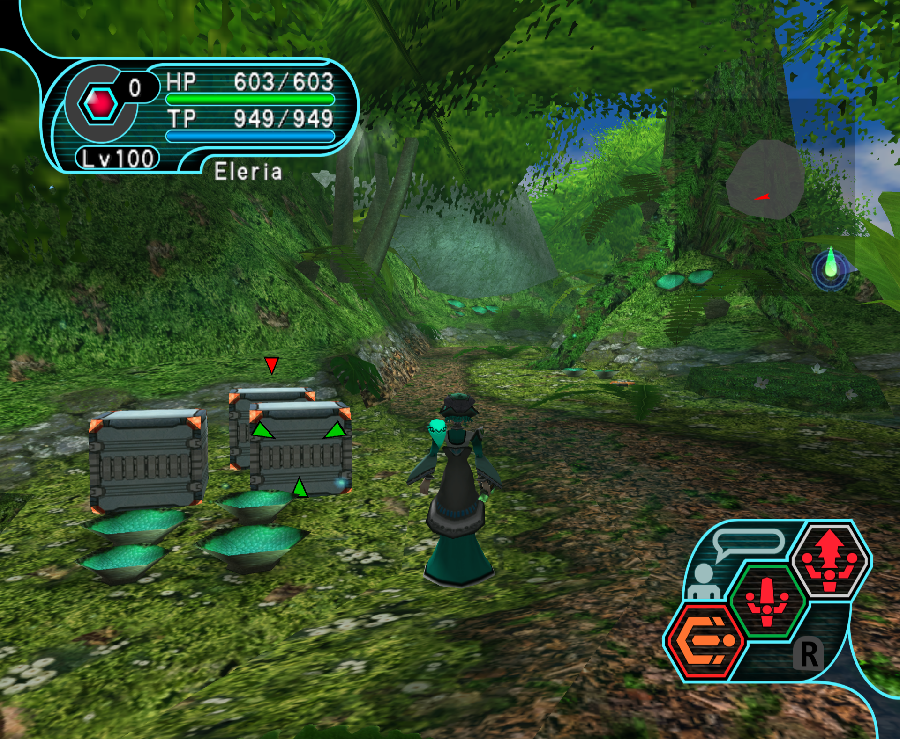

# PSO High Res UI
Fan-made High resolution UI for Phantasy Star Online Ep. I&II (& Plus).

Available for downlad as a _Resource Pack_ compatible with Dolphin emulator.

__Does not work on real hardware__

## Showcase

  
Image(s)

  
  
  

## Production Logos
Sonic Team logo was taken from [Logopedia](https://www.logos.fandom.com)

SEGA, Sofdec, ADX logos were taken from segaretro.org [SegaRetro](https://www.segaretro.org)

They have been adjusted and re-coloured where needed to fit this project.

## Legal
Phantasy Star Online is a registered trademark of SEGA in the United States and other countries.
This project is not endorsed, sponsored, nor authorized by SEGA.
